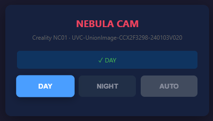

# Nebula Cam Mode

Control de modo IR para la cámara **Creality Nebula Camera** en el ecosistema Klipper/Moonraker/Mainsail.

Controla el filtro IR (día/noche/auto), brillo, contraste, exposición y demás controles V4L2 mediante una interfaz web en Mainsail o macros G-code desde Klipper.



## Instalación

```bash
git clone https://github.com/tu-usuario/nebula-cam-mode.git ~/nebula-cam-mode
cd ~/nebula-cam-mode
./install.sh
```

Luego añadir en `printer.cfg`:

```ini
[include camera_macros.cfg]
[include shell_command_additions.cfg]
```

## Uso

### CLI

```bash
python3 nebula_cam_mode.py day|night|auto        # Cambiar modo IR
python3 nebula_cam_mode.py status -j              # Estado completo en JSON
python3 nebula_cam_mode.py set brightness 100     # Ajustar control V4L2
python3 nebula_cam_mode.py expose manual 500      # Exposición manual
python3 nebula_cam_mode.py brightness_up          # Brillo +10
python3 nebula_cam_mode.py --device /dev/video2 status
```

### Web (Mainsail)

Tras la instalación, aparece "CAM MODE" en el menú lateral. Panel con botones DAY/NIGHT/AUTO y tabla de controles V4L2.

### G-code (Klipper)

| Macro | Descripción |
|---|---|
| `CAMERA_DAY` | Modo día |
| `CAMERA_NIGHT` | Modo noche |
| `CAMERA_AUTO_CAM` | Modo auto |
| `CAMERA_BRIGHTNESS_UP` | Brillo +10 |
| `CAMERA_BRIGHTNESS_DOWN` | Brillo -10 |
| `CAMERA_EXPOSURE_MANUAL EXP_VAL=500` | Exposición manual |
| `CAMERA_EXPOSURE_AUTO` | Exposición automática |
| `CAMERA_STATUS` | Estado completo |
| `CAMERA_INFO` | Info de firmware |

## Arquitectura

### Diagrama

```
Mainsail UI (navi.json)
      ↕ HTTP
Moonraker (camera_mode.py) — 9 endpoints
      ↕ subprocess + JSON
nebula_cam_mode.py — CLI central
      ↕ UVC ioctl + v4l2-ctl
Creality Nebula Camera NC01

         ─── y también ───

Klipper G-code macros → shell_commands (CFG) → nebula_cam_mode.py
```

### Componentes

- `nebula_cam_mode.py` — Script CLI que controla la cámara via UVC Extension Unit + v4l2-ctl
- `moonraker_component/camera_mode.py` — Plugin Moonraker asíncrono (9 endpoints HTTP)
- `camera_macros.cfg` — Macros G-code para Klipper
- `shell_command_additions.cfg` — Shell commands que conectan macros con el script
- `install.sh` — Script de instalación para Raspberry Pi

Los perfiles de brillo/contraste por modo IR se guardan en `~/.nebula_cam_profiles.json`.

## Cómo funciona

### Control IR via UVC Extension Unit

La cámara expone una **Extension Unit USB Video Class** (ID 6) que permite controlar el filtro IR mediante ioctls:

- **Selector 16** (`SEL_MODE`): leer/escribir el modo IR actual
  - `0x00` = DAY (filtro IR puesto, imagen color, LEDs apagados)
  - `0x01` = NIGHT (filtro IR quitado, imagen BN, LEDs encendidos)
  - `0x02` = AUTO (el firmware decide según el sensor de luz)
- **Selector 15** (`SEL_FIRMWARE`): leer la versión de firmware

El script envía un comando `UVC_SET_CUR` y luego lee con `UVC_GET_CUR` para confirmar. Si el readback no coincide, reintenta una vez.

### Controles V4L2

Todos los controles de imagen se manejan mediante `v4l2-ctl` (`-c` para set, `-C` para get), usando el estándar Video4Linux2. El script define rangos conocidos para cada control:

| Control | Rango | Default |
|---|---|---|
| brightness | 50–160 | 128 |
| contrast | 50–160 | 128 |
| saturation | 50–160 | 128 |
| hue | 50–160 | 128 |
| gamma | 0–800 | 400 |
| sharpness | 50–160 | 128 |
| backlight_compensation | 0–4 | 0 |
| exposure_time_absolute | 1–1000 | 156 |
| focus_absolute | 0–1000 | 500 |
| zoom_absolute | 100–200 | 100 |
| white_balance_temperature | 300–600 | 417 |
| auto_exposure | 0=auto / 1=manual | — |
| white_balance_automatic | boolean | — |
| focus_automatic_continuous | boolean | — |

### Perfiles por modo IR

Cuando se cambia de modo IR, el script aplica automáticamente los valores guardados para ese modo. Al usar `set`, el valor se guarda en el perfil del modo actual.

- `~/.nebula_cam_profiles.json` contiene los perfiles `day` y `night`
- Al cambiar a night, si no hay exposure guardado, se fija exposición manual a 500ms automáticamente para evitar que el auto-exposure anule el brillo
- Se puede reiniciar un perfil con `profile day` o `profile night`

### Plugin Moonraker

El plugin `camera_mode.py` se registra como componente de Moonraker y expone 9 endpoints:

| Endpoint | Método | Función |
|---|---|---|
| `/machine/camera_mode/panel` | GET | Renderiza HTML del panel de control |
| `/machine/camera_mode/status` | GET | Estado completo en JSON |
| `/machine/camera_mode/info` | GET | Firmware + capacidades |
| `/machine/camera_mode/day` | POST | Cambiar a modo día |
| `/machine/camera_mode/night` | POST | Cambiar a modo noche |
| `/machine/camera_mode/auto` | POST | Cambiar a modo auto |
| `/machine/camera_mode/expose` | POST | Configurar exposición |
| `/machine/camera_mode/set` | POST | Ajustar un control V4L2 |
| `/machine/camera_mode/get` | GET | Leer un control V4L2 |

Cada handler ejecuta `sudo python3 ~/nebula-cam-mode/nebula_cam_mode.py <args> -j` y devuelve el JSON parseado.

### Panel web

El endpoint `/panel` renderiza HTML con CSS y JavaScript inline. El JS incluye:

- Función `setM(m)` para cambiar modo via POST a day/night/auto, actualiza UI y resalta botón activo
- Función `refresh()` que consulta `/status` cada vez que carga la página para mantener el botón activo sincronizado

### Flujo completo de ejemplo

```
Usuario pulsa NIGHT en el panel web de Mainsail
  → JS hace POST a /machine/camera_mode/night
    → Moonraker ejecuta: sudo python3 nebula_cam_mode.py night -j
      → Script abre el dispositivo UVC por ioctl
      → Escribe 0x01 en Extension Unit, selector 16
      → Lee confirmación (reintenta si no coincide)
      → Aplica perfil "night" (fija exposición manual + valores guardados)
      → Devuelve JSON: {"action":"set_ir","mode":"night",...}
    → Moonraker devuelve el JSON al JS
  → JS actualiza UI: marca botón NIGHT como activo, muestra ✓
```

## Instalación manual paso a paso

Si prefieres no usar `install.sh` o tu configuración es atípica:

1. Copia `moonraker_component/camera_mode.py` a `~/printer_data/moonraker/custom_components/`
2. Añade `[camera_mode]` a `moonraker.conf`
3. Añade regla sudoers para el script: `pi ALL=(ALL) NOPASSWD: /home/pi/nebula-cam-mode/nebula_cam_mode.py`
4. Copia `navi.json` a `~/printer_data/config/.theme/navi.json`
5. Configura nginx para proxy inverso de `/machine/camera_mode/` a `http://127.0.0.1:7125`
6. Incluye `camera_macros.cfg` y `shell_command_additions.cfg` en `printer.cfg`
7. Reinicia Moonraker

## Solución de problemas

### El panel CAM MODE aparece en blanco

Revisa los logs de Moonraker (`~/printer_data/logs/moonraker.log`). El JS del panel silencia errores en `refresh()` — si el endpoint `/status` falla, no se ve el error en el navegador.

### Error al cambiar de modo IR

Verifica que la cámara esté conectada y sea detectada:
```bash
python3 ~/nebula-cam-mode/nebula_cam_mode.py info
```
Si no detecta el dispositivo automáticamente, usa `--device /dev/videoN`.

### "sudo: no tty present"

La regla sudoers debe estar correctamente instalada en `/etc/sudoers.d/`. Verifica:
```bash
sudo -l | grep nebula_cam_mode
```
Debe mostrar que puedes ejecutar el script sin contraseña.

### Los controles V4L2 no cambian

Algunos controles requieren que ciertos modos automáticos estén desactivados. Por ejemplo, para ajustar exposure manual, primero debes desactivar auto-exposure con `expose manual`.
